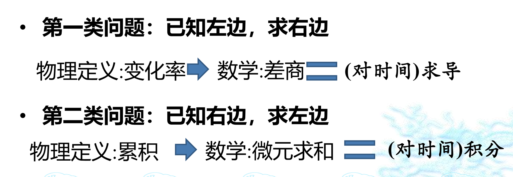

## 概念
1. 质点：理想化模型
2. 坐标系：常用二维(x,y),三维（x,y,z）

## 各种等式
1. 位置矢量$\vec{r}:ai+by+cj $ 
2. $  位移\Delta \vec{r}:即位置的矢量差$
3. $\Delta r:位置模的差$
4. $平均速度\vec{v}=\frac{\Delta \vec{r}}{\Delta t}，可分方向求解$
5. $瞬时速度\vec{v}=\lim_{\Delta t \to 0}\frac{\Delta \vec{r}}{\Delta t}=\frac{dx}{dt}i+\frac{dy}{dt}j，就是求导$
6. $\vec{a}=\lim_{\Delta  t \to 0}\frac{\Delta \vec{v}}{\Delta t}=\frac{d\vec{v}}{dt}$

## 解题目方法
1. 找到等价关系，列出等式
2. 
3. 
4. 积分可用不定积分   *（结合初始条件确定C的值)*
   或者直接用定积分  *（等式左右定积分的上下限视情况而定。不一定相同）*

