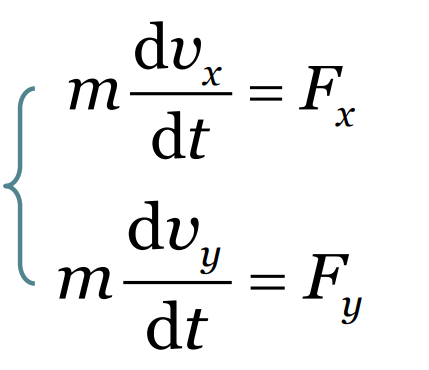

## 牛顿第二定律
$\vec{F}=m\vec{a}\rightarrow m\frac{d\vec{v}}{dt}=\sum \vec
F$
### 直角坐标系

### 自然坐标系

## 基本力
### 引力

**重力为引力的分量**
$mg \approx \frac{GmM}{R^{2}}$
### 弹性力
#### 方向
刚性物体：接触面法向
柔性物体：伸展方向
#### 大小
1. 胡克定律
2. 运动状态确定（参考教材P34）
   
==绳子上的拉力不一定处处相等==

### 摩擦力
*相对运动或有运动趋势时产生*
#### 方向
接触面切向且与运动或运动趋势相反
#### 大小
滑动摩擦力
静摩擦力

