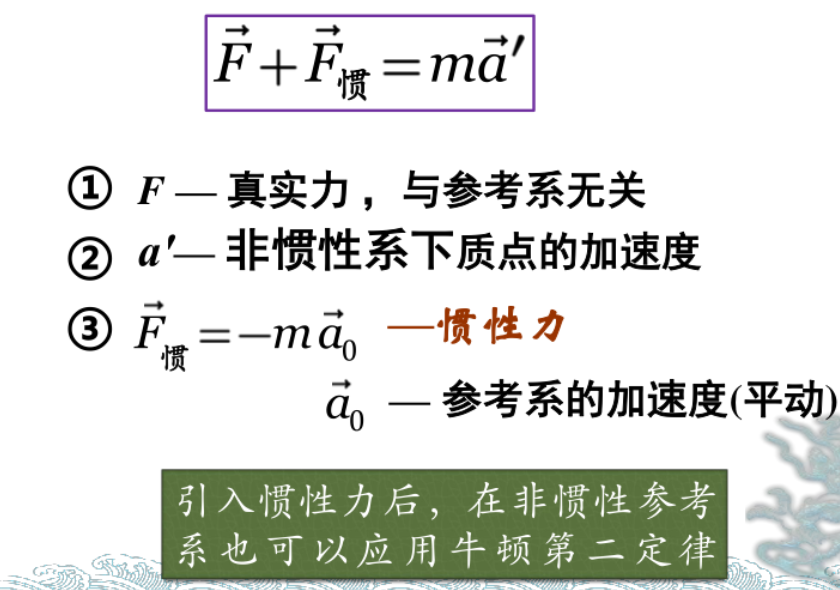
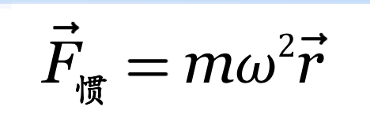
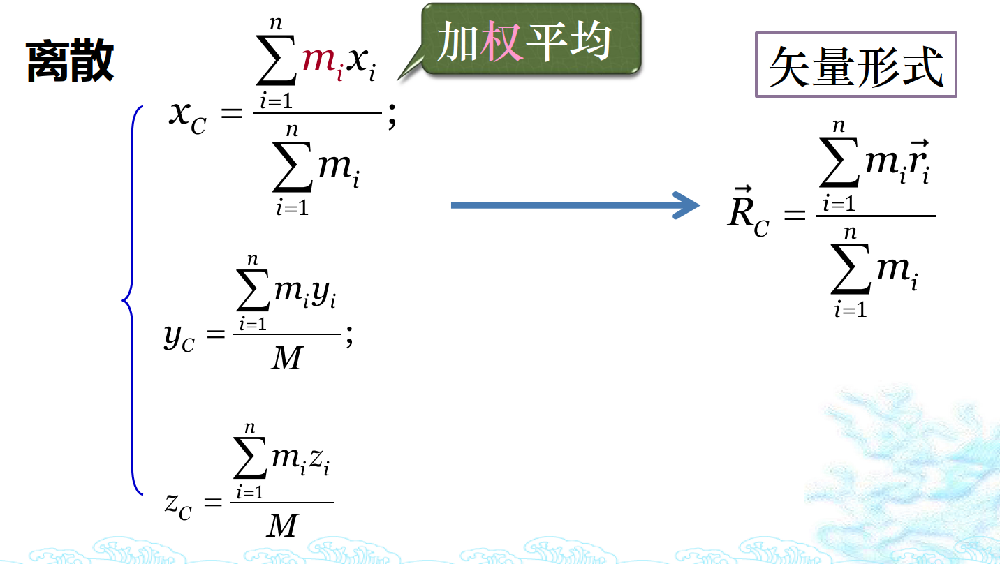
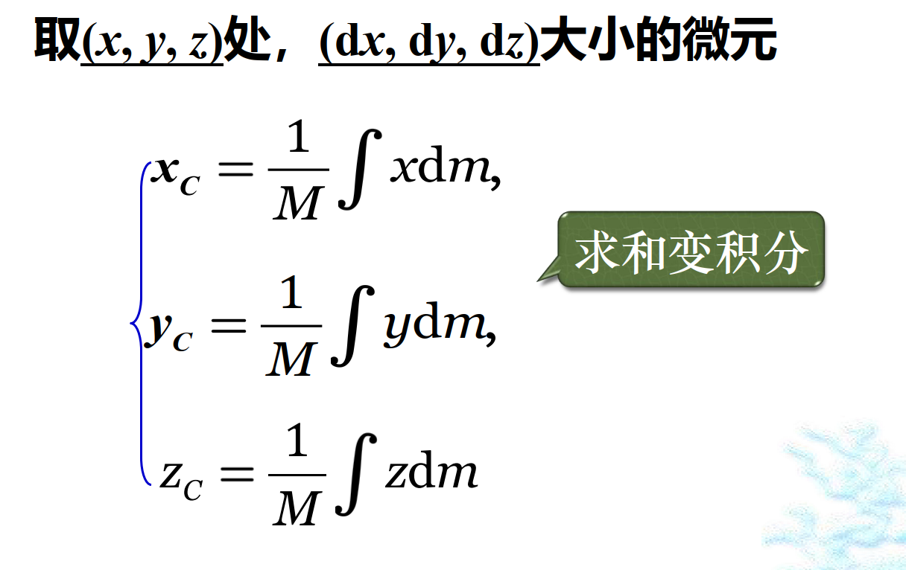
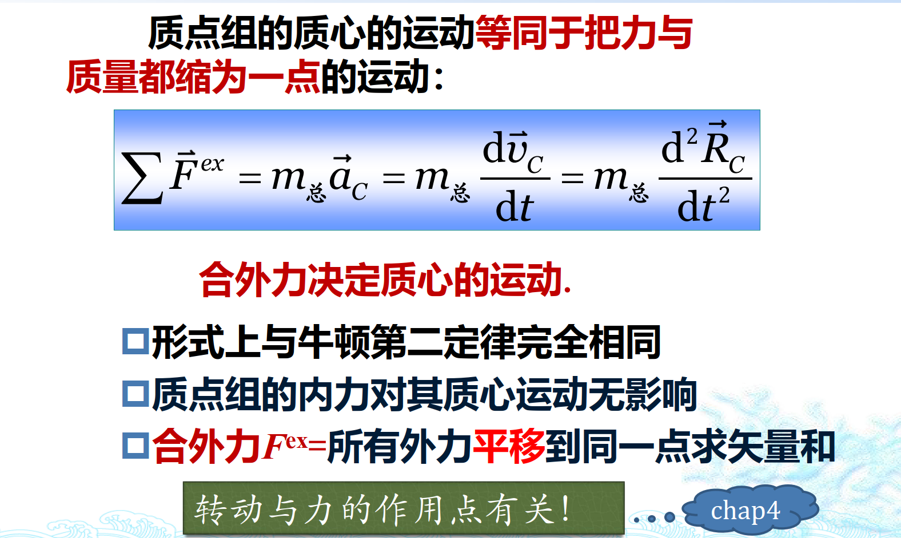

牛顿运动定律适用条件：惯性系+质点
==
## 惯性系
判断：
1. 匀速/静止
2. 相对于另一个惯性系（如地面）无加速度
3. 牛顿运动定律成立

## 非惯性系下的牛顿运动定律
### 惯性力

（求法来自于相对运动）
1. 惯性力无反作用力
2. 惯性力具有于真实力相同的效果（做功等）

### 惯性离心力

沿着半径向外

## 质心
即质量的中心
### 确定质心

（根据关系确定微元的质量，乘以该微元的位置，求积分后除以总质量）

### 质心运动定律
