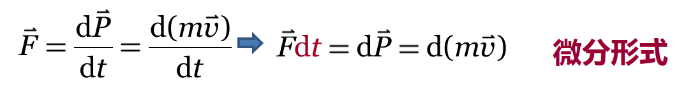
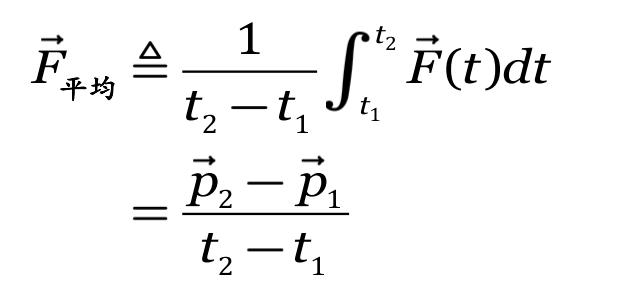
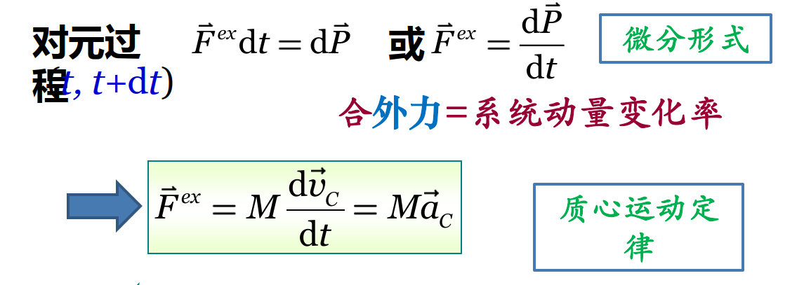
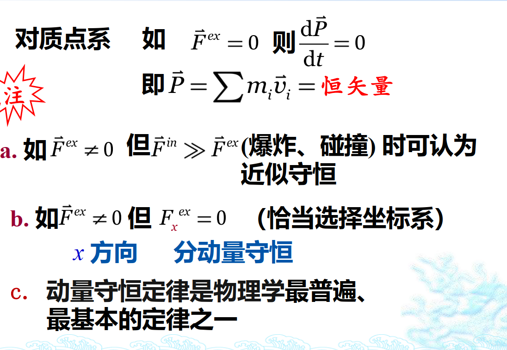
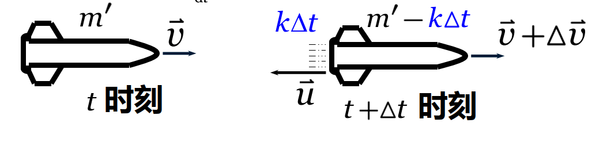

## 预习（相比于高中动量的内容）
1. 直接在向量层面进行运算
2. 从离散到连续（使用积分求解）
3. 动量守恒（内力作用改变系统内物体的动量，而不改变总动量）

## 质点动量定理

(可由牛顿第二定律F=ma推出)
相比于牛顿运动定律，有着更普遍的适用范围。
==矢量要考虑方向和大小该变量==

## 质点系动量定理

合外力改变系统动量
内力改变系统内各部分的动量，不改变总动量

==相对速度要相对于变化后的速度==

## 质量迁移问题

元过程分析法
$\frac{dm^{'}}{dt}=-k$
$p_1=m^{'} \vec v$
$p_2=(m^{'}-k\Delta t)(\vec v+\Delta \vec v)+(k\Delta t)(\vec v+\Delta \vec v+\vec u)$
$\vec F=\frac{p_2-p_1}{\Delta t}=\frac{m^{'}\Delta \vec v+k\Delta t \vec u}{\Delta t}=m^{'}\frac{\Delta \vec v}{\Delta t}+k\vec u$
$\vec F\Delta t=m^{'}\Delta \vec v-dm^{'}\vec u$