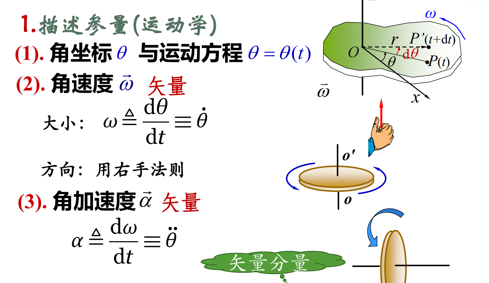
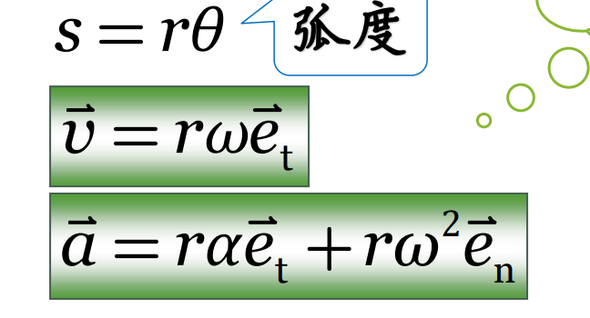
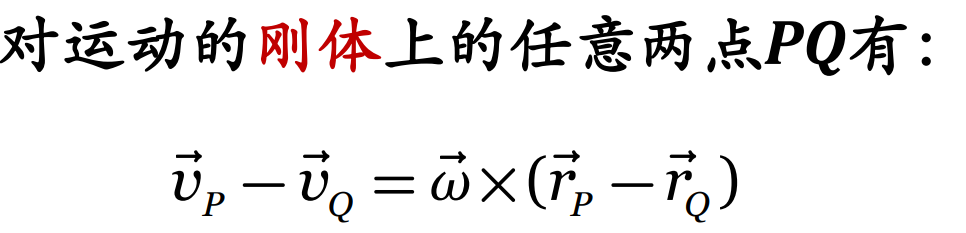
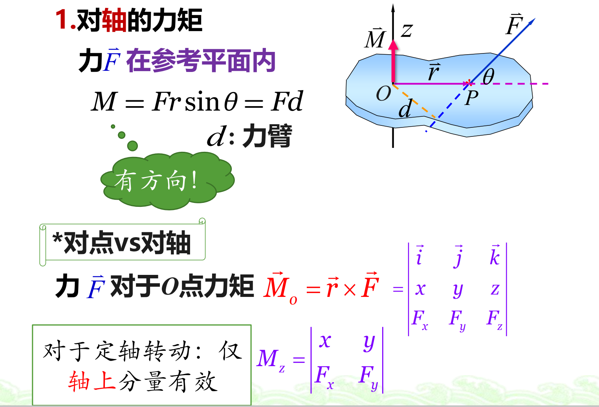

# 预习
1. 刚体的概念：刚体是指在运动中和受力作用后，形状和大小不变，而且内部各点的相对位置不变的物体。
2. 加速度分为法向加速度和切向加速度，且切向加速度=r$\beta$(角加速度)
3. 右手螺旋法则确定角速度的正方向

## 刚体转动的描述

$V_{线}=rw$
$a_{n}=rw^{2}$
$a_t=r \alpha$

==刚体转动时各点的角速度相同==

## 力矩

方向：从r到F,右手螺旋法则

## 刚体转动定律
$M=J\alpha$
