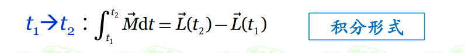

## 转动惯量

### 常见

薄圆环：$J=mr^{2}$

### 意义
类似刚体中的质量
转动惯性

### 计算
1. 离散：$J=\Sigma m_i r_i^{2}$
2. 连续：$J=\int r^{2}dm$
3. 平行轴定理:$J_o=J_c+md^{2}(J_c：绕质心的转动惯量)$

## 角动量

$\vec L=\vec r \times \vec p=\vec rm\vec v$
指定O点
==故角动量方向与角速度方向不一定相同==
$L=J\vec w$

## 角动量定理

**合力矩为0，系统角动量守恒**

## 多体运动
1. 滑轮模型，若右边绳子向下运动（设正方向为向下），则左边绳子正方向为向上
2. $a=\alpha R |$角量与线量的关系（这只是接触点的线量与角量关系，与绳子相连还要考虑质点运动与它合成）
