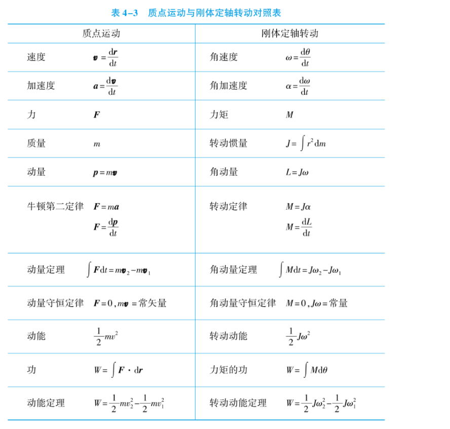
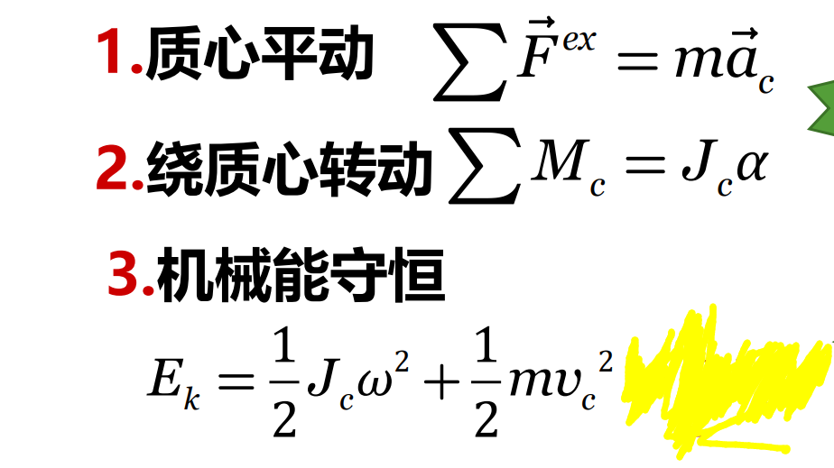

## 功的力矩求法
$dW=Md\theta$
$P=Mw$

## 刚体动能
$E_k=\frac{1}{2}Jw^{2}=\frac{1}{2}\frac{\vec l^{2}}{J}$

## 平面平行运动

以刚体与地面的接触点展开研究：

$Vp=Vc-wR$

非纯滚动状态下是滑动摩擦力

### 纯滚动
条件：$V_c=wR或a_c=R\alpha$
此时$E_k=\frac{1}{2}J_cw^{2}+\frac{1}{2}m V_c^{2}=\frac{1}{2}J_ow^{2}$(转轴为刚体与地面的接触点)

摩擦力为静摩擦力
