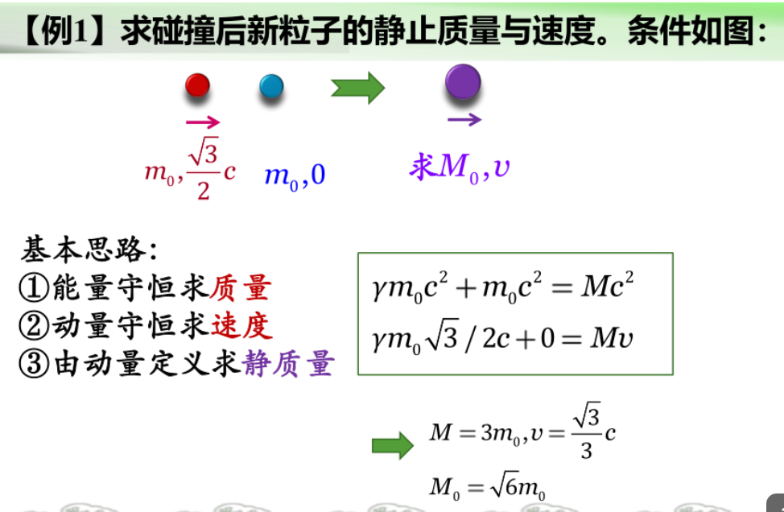

## 基本定理
1. 真空中光速不变原理
2. 相对性原理（任何物理规律在所有惯性系中形式相同）

## 洛伦兹变换

注意点：
1. 若S'相对于S向x轴负轴运动，则v要用-v代入
2. X轴上的相对运动的Y轴Z轴上的空间没有影响

## 时空
时空唯一
==

## 尺缩与时缓

原长、固有时都是在相对物体/时钟静止的参考系里测量的

## 动力学
$p=\gamma m_0 v=mv$

（由动量不变推出）

$E_=mc^{2}=E_k+m_0c^{2}$
动能=总能量-静能量
$\Delta E=\Delta m c^{2}$

等价形式
$E^{2}=E_{0}^{2}+p^{2}c^{2}$

## 一个例子

