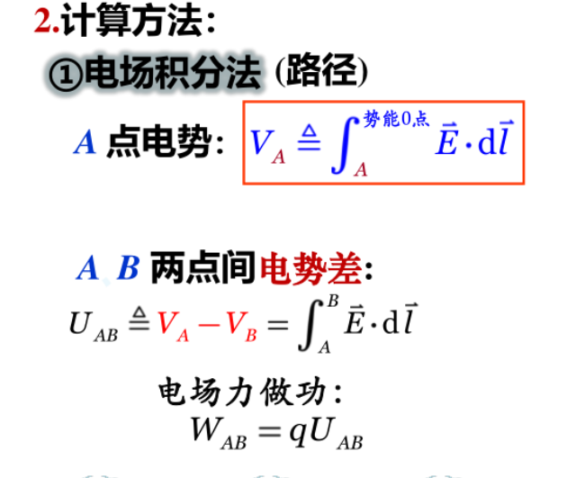
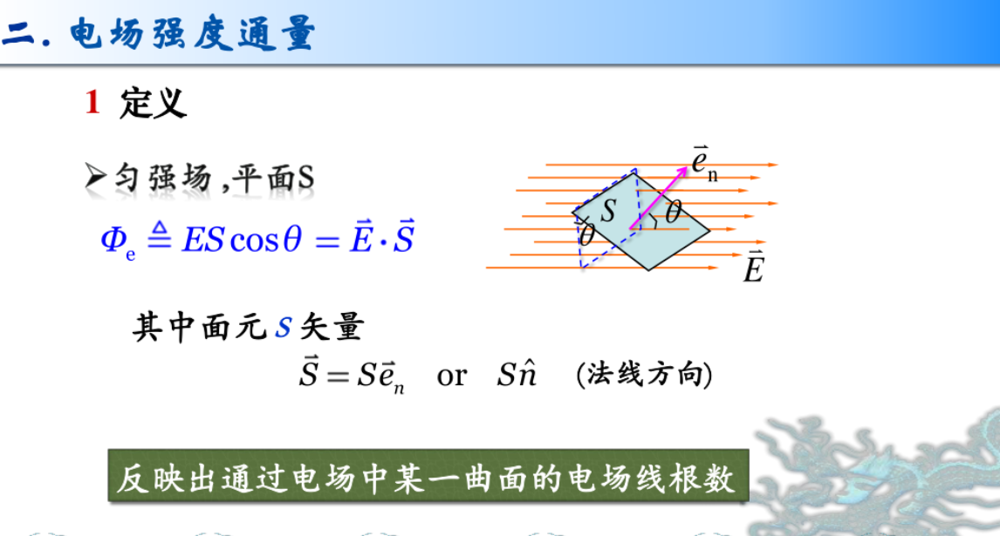
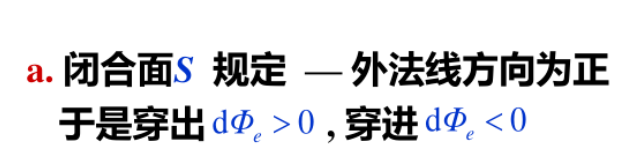
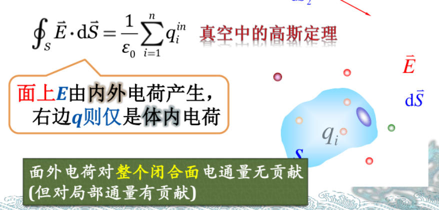
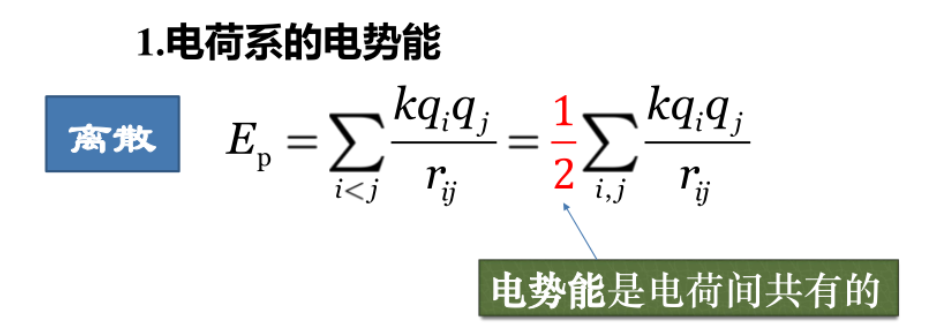
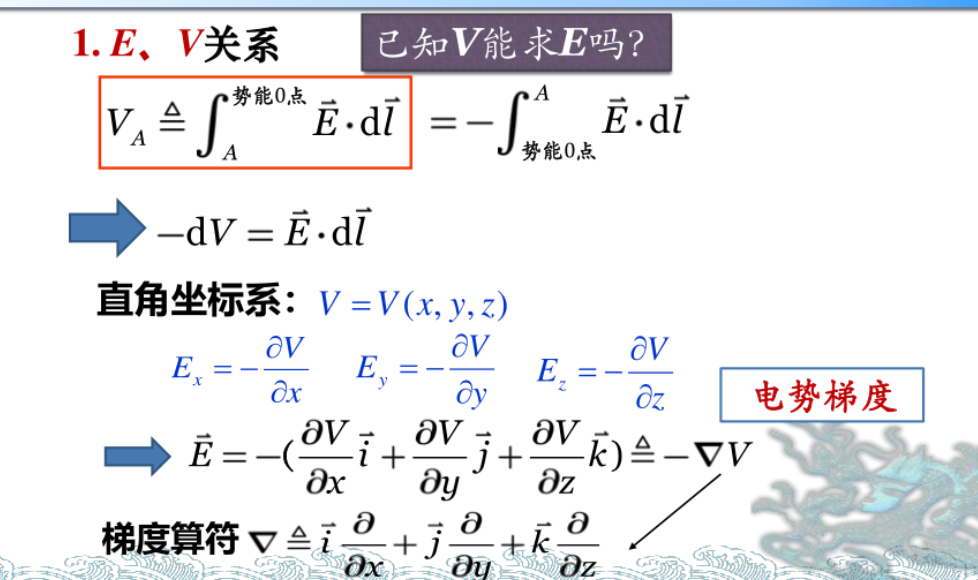

## 重要原理
1. 电场叠加（需要注意分方向）
*一般情况为矢量和，可划分方向相加*
2. 电势叠加（直接加）
3. 高斯定理

## 重要公式
1. 真空中点电荷$F=\frac{q}{4\pi \epsilon_0r^{2}}\vec e_r$

2. 真空中点电荷产生的电势$V=\frac{q}{4\pi \epsilon_0r}$

3. 电偶极矩$\vec p=q\vec r_0$

4. 
  *可以结合第二型曲面积分与路径无关求解*

  

## 高斯定理

（所以局部场强可能会出现不一样的情况）

非特殊情况乖乖用微元法求解

## 电势能
$W=qU$
静电力做正功，电势能减少

$(a)2^{n}$ and $6\times 2^{n}+n^{2}$
$(b)n^{2}$ and $\frac{2^{n}}{4}$
$(c)n^{n}$ and $n!$
$(d)n^{3}$ and $\frac{6n^{3}}{\log n +1}$

$\cos ^{2}()$

$\begin{matrix}
0&6  \\0&0\\0&4
\end{matrix}\times \begin{matrix}
0&3&0 \\3&0&0
\end{matrix}=\begin{matrix}
18&0&0 \\0&0&0\\12&0&0
\end{matrix}$
$\begin{pmatrix}
0&6  \\0&0\\0&4
\end{pmatrix}^{T}=\begin{pmatrix}
0&0&0\\6&0&4
\end{pmatrix}$

$ \begin{cases}
    r=\sqrt{x^{2}+y^{2}}
   \\ B = \cos^2\left(\frac{\pi \cdot (2 \cdot n \cdot d \cdot \cos(\arcsin(n \cdot \sin(\arctan(r / f)))))}{\lambda}\right)
\end{cases} $