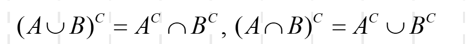

# 集合
## 基本运算
* 并：$\cup$
* 交: $\cap$
* 差 :A\B=$\displaystyle \left\{x|x \in A 但x \notin B  \right\}$

## 运算法则
* 交换律
* 结合律
* 分配律
* 对偶原理：

# 实数集
## 重要性质
* 稠密性
* 完备性  （*有理数集无*）
* 有界性：上界/下界

## 确界存在定理
非空有上(下)界的数集必有上(下)确界.

# 映射与函数
## 映射
$f:x \mapsto y=f(x),x \in A.$
y称为象,x称为原象
  * 单射
  * 满射
  * 一一映射

## 函数
* 初等函数
* 非初等函数$\begin{cases}
    分段函数 \begin{cases}
        取整函数 \\ 符号函数 \\ Dirichlet函数：D(x)=\begin{cases}
            1,x\in Q \\ 0,x \in R / Q \\
        \end{cases} \\ \cdots 
    \end{cases} \\ \cdots 
\end{cases}$

双曲函数
* sh x
* ch x
* th x
## 逆映射与反函数
**!!反函数注意定义域与值域**
$\sin x无反函数（定义域为R）$
$\sin x,x \in (-\frac{\pi}{2},\frac{\pi}{2})有反函数\arcsin x$
