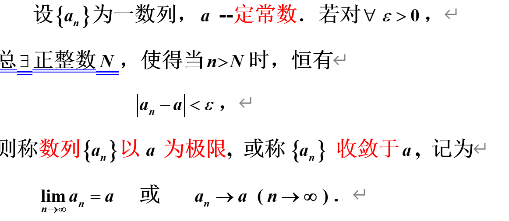
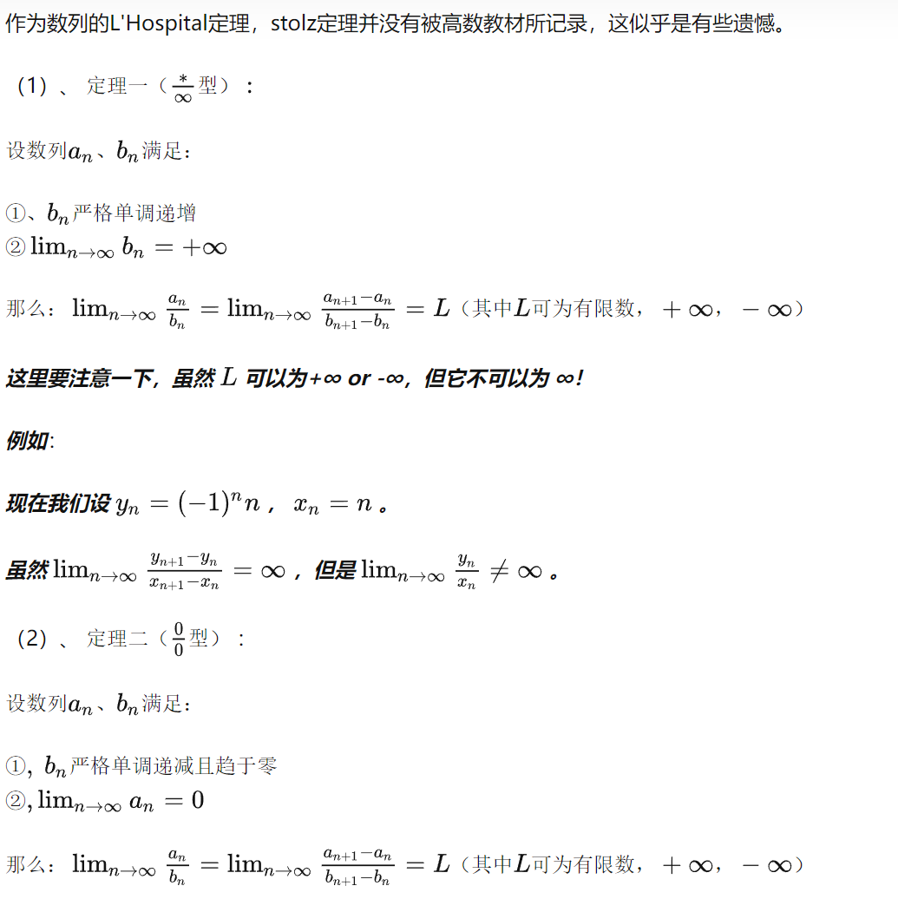

## 定义

## 重要性质
1. 收敛数列极限唯一
2. 收敛数列有界，有界数列不一定收敛 *如$y=(-1 )^{x}$*
3. 绝对值性质
4. 保序性
5. 夹逼性
6. 拉链法则
7. 有界数列必有收敛子列

## 判断数列是否有极限
1. 定义，$\varepsilon-N 语言$
2. 极限的有理运算法则
3. 单调有界准则
4. 夹逼定理
5. 子列是否收敛到同一个常数/子列是否收敛
6. 柯西收敛原理:$\left\vert a_m-a_n \right\vert < \varepsilon 或\left\vert a_{n+p}-a_n \right\vert <\varepsilon   $
7. 绝对值性质，求$\lim_{n \to \infty}\left\vert a_n \right\vert $
8. Stolz公式 
   