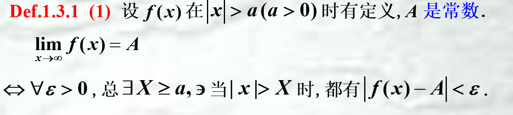
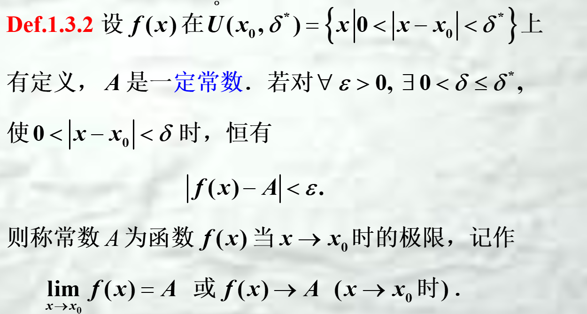
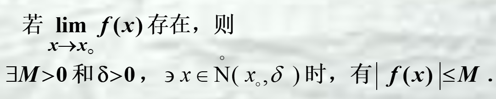
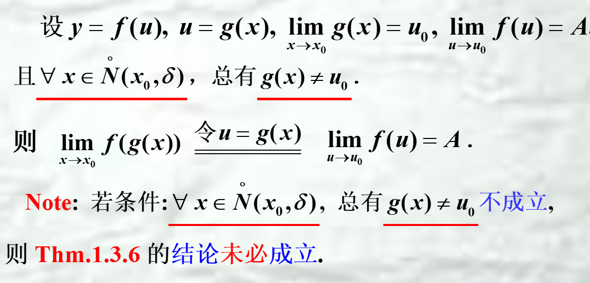
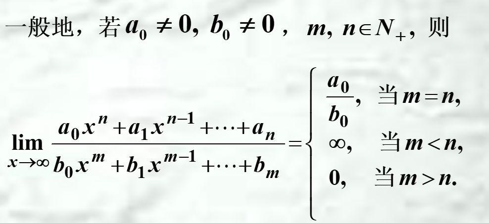
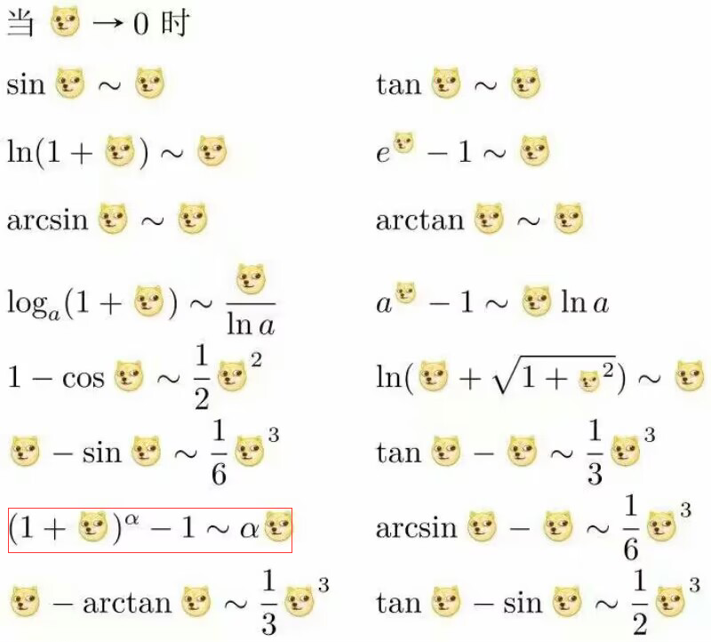

## 定义

### 单侧极限
$f(x_o+o)=\lim_{x \to x_o^{+}}f(x)$
$f(x_o-o)=\lim_{x \to x_o^{-}}f(x)$

## 性质
1. 极限存在必唯一
2. 局部有界性
3. 局部保序性
4. 绝对值性质

## 计算极限
1. 极限的有理运算法则
2. **换元法**（常用于有根号/$x \to \infty$）
3. 单调有界（需要是确界）
4. 夹逼定理
5. 海涅定理：子列收敛到同一极限
6. 柯西收敛准则
7. 洛必达法则
8. 无穷小量代换
9. 重要极限
    * $\lim_{f(x) \to 0}\frac{\sin f(x)}{f(x)}=1$
    * $\lim_{f(x) \to \infty}(1+\frac{1}{f(x)})^{f(x)}=e$
10. 复合函数求极限
    

11. 

## 无穷小量与无穷大量
### 性质
1. **有限**个无穷小量的代数和以及**有限**个无穷小量的乘积仍是无穷小量
2. 有界变量与无穷小量的乘积仍是无穷小量
3. **有限**个无穷大量的**乘积**仍为无穷大量（和不行，正无穷+负无穷结果不确定）
4. 有界变量与无穷大量的和仍为无穷大量

### 无穷小的阶
* 高阶无穷小 $\lim \frac{a(x)}{b(x)}=0$
* 同阶无穷小 $\lim \frac{a(x)}{b(x)}=C（常数）$
* 等价无穷小 $\lim \frac{a(x)}{b(x)}=1$
* k阶无穷小  $\lim \frac{a(x)}{b(x)^{k}}=C$

### 无穷大的阶
* 高阶无穷大 $\lim \frac{a(x)}{b(x)}=0$
* 同阶无穷小
* 等价无穷小
* k阶无穷小

### 等价无穷小的性质
1. 等价代换 ----> 只可用于乘除运算
2. 若a(x) ~ b(x),则a(x)=b(x)+o(x) ----> 所有地方都可以代

## 常见等价无穷小

   