## 连续性定义
$\begin{cases}
   \lim_{x \to x_o^{+}}f(x)=\lim_{x \to x_o^{-}}f(x)=f(x_o)  \\\lim_{\Delta x \to 0}\Delta y=0
\end{cases}$

* **f(x)在$x_o$处有定义**

## 间断点
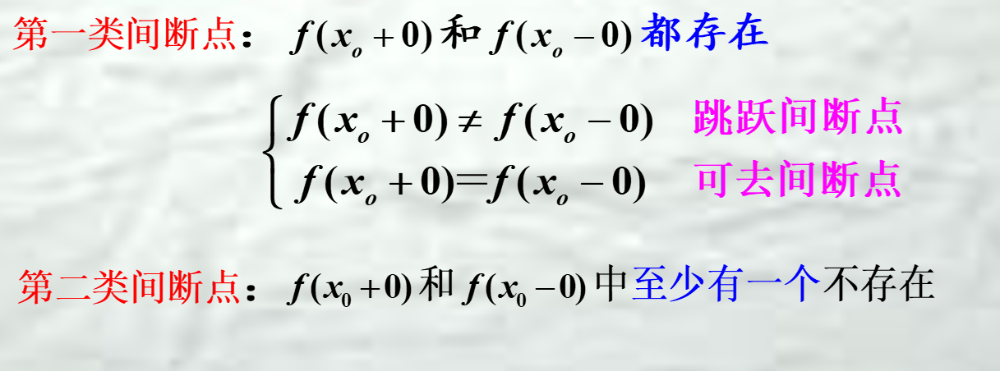
* 区间$ I$上的单调函数f(x) ,若区间内的$x_o$ 为其间断点,则必为跳跃间断点

## 连续性判断
1. 定义
2. 四则运算
3. 反函数，且单调性与原函数相反（如果原函数严格单调）
4. 一切初等函数在其定义区间内都是连续的．
5. F（x）$\in$C[a,b),只需说明在a点右连续
==题目问判断连续性需要说明连续区间和间断点及其类型==

## 闭区间上连续函数性质
1. 最大最小值定理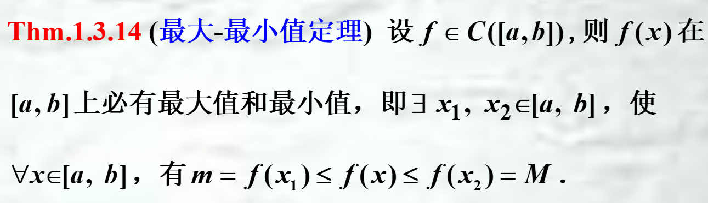
2. 零点定理（端点对应的值异号）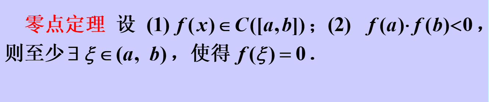
3. 介值定理（可以取到介于最小值和最大值之间的任意数）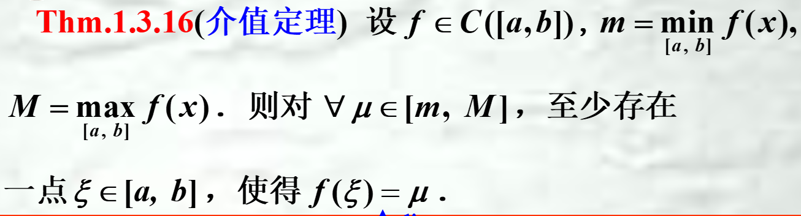
   * 应用：平均值定理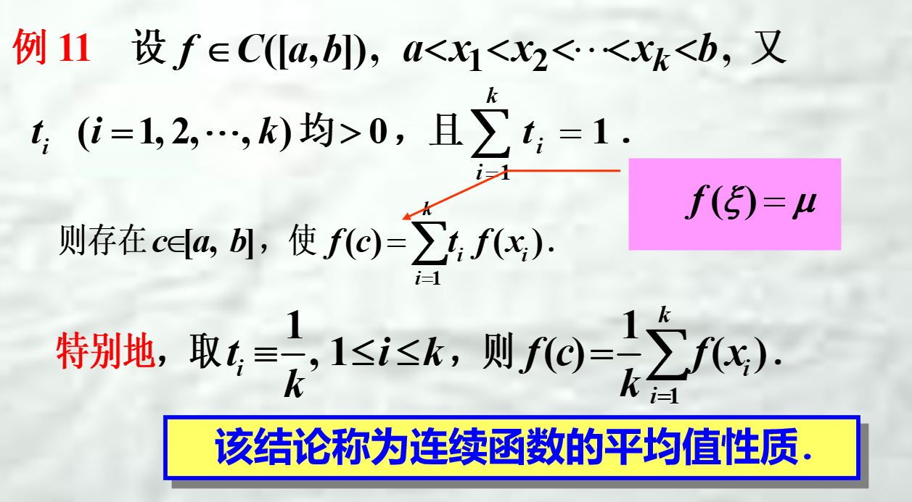

## 注意点
1. 未说明函数在极限值处连续时不可直接将极限值带入函数（应用于求导和求极限）
* 解决办法
  * 求导：用导数定义转换
  * 极限：证函数连续/不能证明的话说明方法错了（
2. 连续区间只能用“，”或者“和” 连接,不能用“U”

## 一致连续性
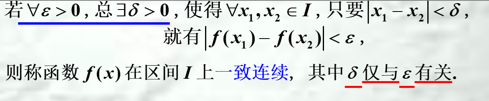

### 判断一致连续性
1. 定义
2. 闭区间上连续函数在该区间内一致连续
3. 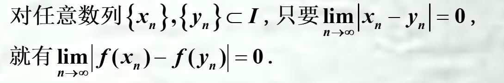==常用于判断非一致连续==
4. 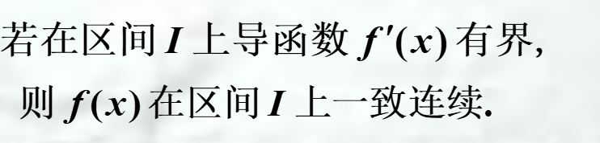
   需要用拉格朗日定理进一步建立f(x)-f(y)与x-y的关系
----
1. 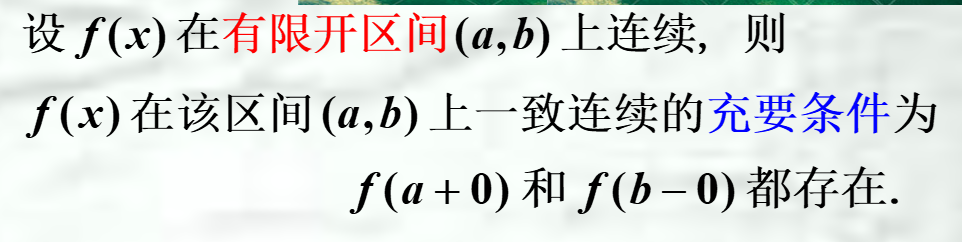
2. 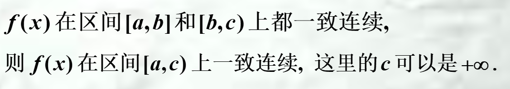
3. 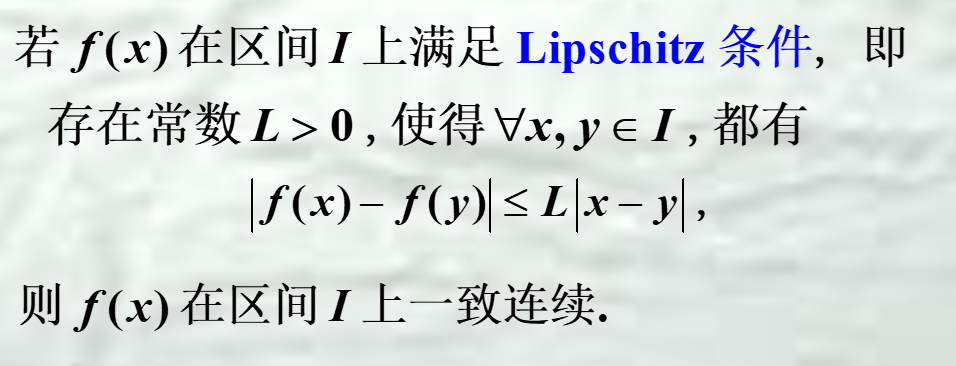
4. 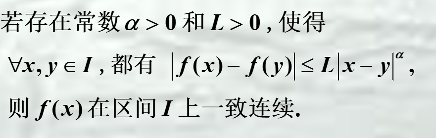
5.  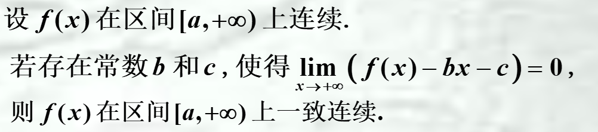
6.  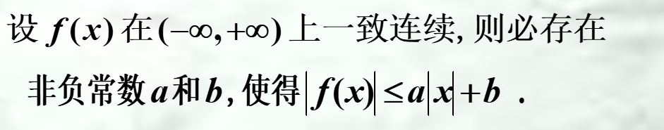