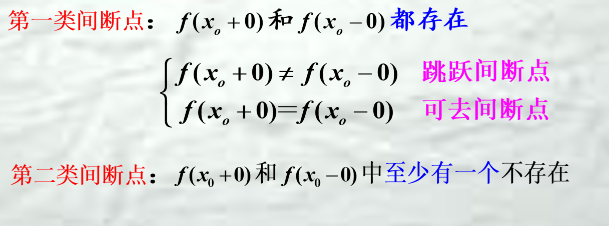
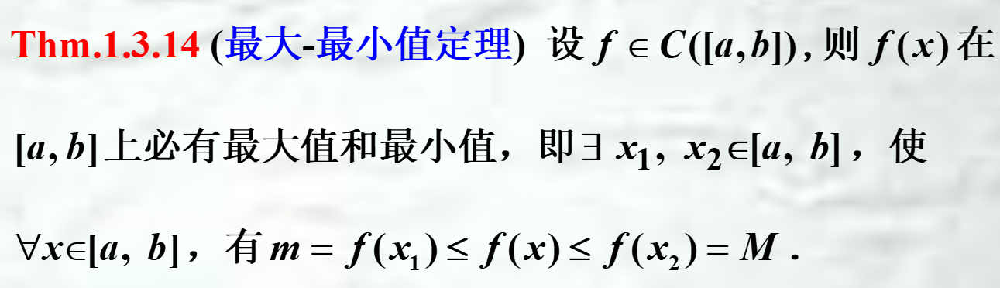
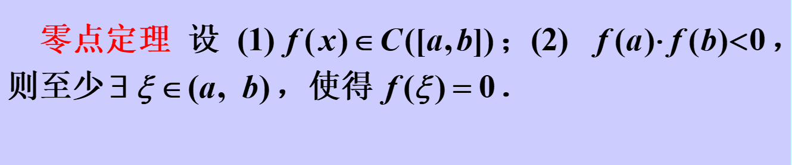
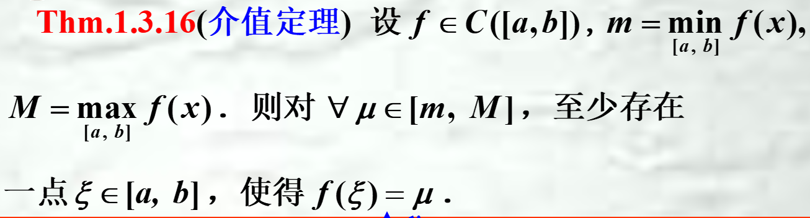
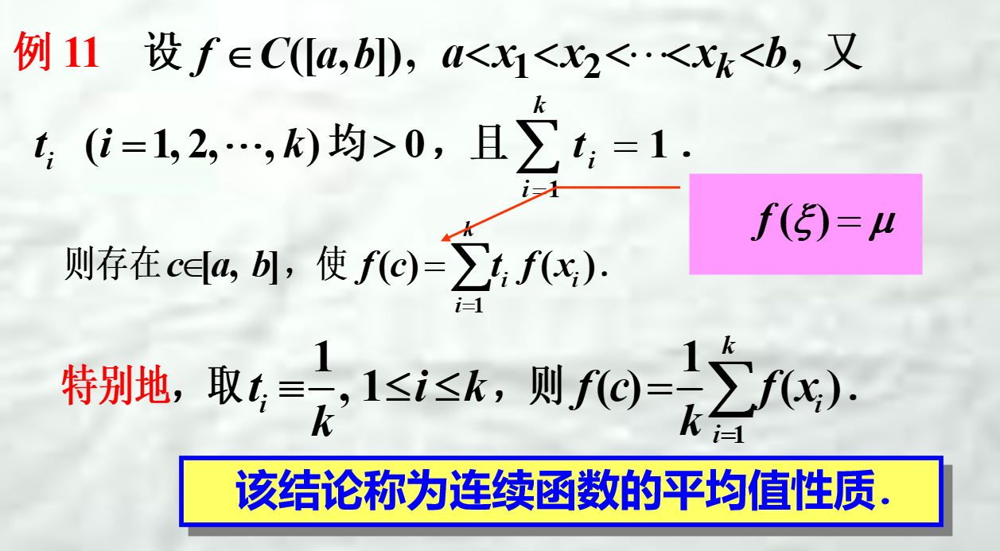

## 定义
$\begin{cases}
   \lim_{x \to x_o^{+}}f(x)=\lim_{x \to x_o^{-}}f(x)=f(x_o)  \\\lim_{\Delta x \to 0}\Delta y=0
\end{cases}$
* 且f(x)在$x_o$处有定义

## 间断点

* 区间$ I$上的单调函数f(x) ,若区间内的$x_o$ 为其间断点,则必为跳跃间断点

## 连续性判断
1. 定义
2. 四则运算
3. 反函数，且单调性与原函数相反（如果原函数严格单调）
4. 一切初等函数在其定义区间内都是连续的．

## 闭区间上连续函数性质
1. 最大最小值定理
2. 零点定理（端点对于的值异号）
3. 介值定理（可以取到介于最小值和最大值之间的任意数）
   * 应用：平均值定理

