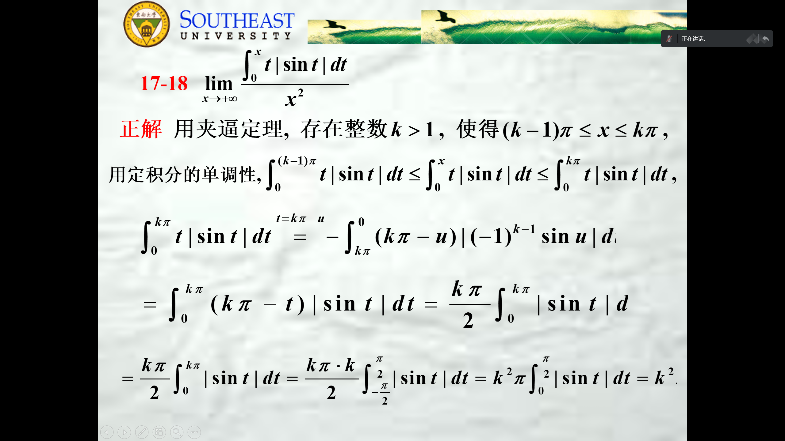
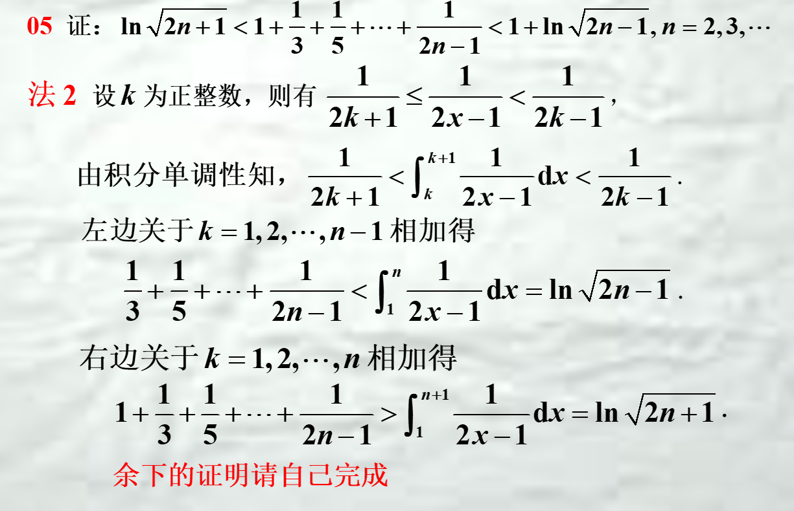

## 定积分
1. **$g(x)是偶函数,\int_{-1}^{1}  f(x)g(x)\mathrm{d}x\equiv 0,证f(x)是奇函数$**
解：利用换元可得,$\int_{-1}^{1}f(-x)g(x)  \mathrm{d}x\equiv 0$
$相加，\int_{-1}^{1}g(x)(f(x)+f(-x))  \mathrm{d}x=0,取g(x)=f(x)+f(-x)$
$则\int_{-1}^{1}(f(x)+f(-x)^{2})  \mathrm{d}x\equiv 0,\therefore f(x)是奇函数$
2. 
   周期函数的极限
3.  
4. $\int_{0}^{1} 对于常数而言任意可加可去$，用于积分不等式

## 不定积分
1. 
$
\begin{aligned}
\int_{1}^{\infty}  \frac{[2x]-2[x]}{x^{2}}\mathrm{d}x \\=\int_{1}^{\infty}  \frac{[2x]-2x-2[x]+2x}{x^{2}}\mathrm{d}x\\ =\int_{1}^{\infty}  \frac{[2x]-2x}{x^{2}}\mathrm{d}x-\int_{1}^{\infty}  \mathrm{d}x\frac{2[x]-2x}{x^{2}}\mathrm{d}x\\=2\int_{2}^{\infty}  \frac{[2x]-2x}{(2x)^{2}}\mathrm{d}2x-2\int_{1}^{\infty}  \mathrm{d}x\frac{[x]-x}{x^{2}}\mathrm{d}x\\=2\int_{1}^{2}  \frac{x-[x]}{x^{2}}\mathrm{d}x\\=2\int_{1}^{2}  \frac{x-1}{x^{2}}\mathrm{d}x
\end{aligned}
$
