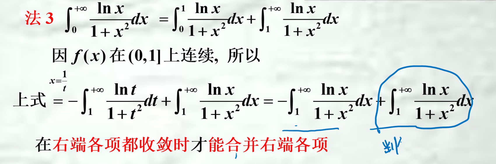

## 注意点
1. 对于上限下限都为奇点的反常积分，应将其拆开分别求极限，且不能用同一个字母（比如一个是$\lim_{a \to \infty}还有一个是\lim_{b \to \infty}$）
2. ==都收敛就能分==
   故正解为省略第二第三步直接写第四步
   
3. 绝对值不等式
   $若f在任何有限区间[a,u]上可积，且有\int_{a}^{+\infty }\left | f(x) \right |dx收敛，则\int_{a}^{+\infty }f(x)dx亦必收敛，并有\left | \int_{a}^{+\infty }f(x)dx \right |\leqslant \int_{a}^{+\infty }\left | f(x) \right |dx.绝对收敛与条件收敛$
4. 反常积分求值可考虑转化为定积分求值（换元法，利用积分区间的可加性转换）

## 特殊的反常积分
P积分:$\int_{1}^{\infty} \frac{1}{x^{p}} \mathrm{d}x,p>1收敛，p\le 1发散$
==
Q积分:$\int_{a}^{b} \frac{1}{(x-a)^{q}} \mathrm{d}x,q<1收敛，q\ge 1发散$
==

## 判敛法则
步骤：1. 首先判断有几个反常点 2. 灵活运用p积分q积分及相关方法

1. 比较判敛法
2. 
3. 频繁使用洛必达、无穷小量等价代换（0为不定点）
4. $如果选用\int_{1}^{+\infty }\frac{dx}{x^p}作为比较对象，有如下两个推论$
$设f定义于[a,+\infty )（a>0）,且在任何有限区间[a,u]上可积，则有：$
$(i)当0\leqslant f(x)\leqslant \frac{1}{x^p},x\in[a,+\infty ),且p>1时，\int_{a}^{+\infty }f(x)dx收敛；$
$(ii)当f(x)\geqslant \frac{1}{x^p},x\in[a,+\infty ),且p\leqslant 1时，\int_{a}^{+\infty }f(x)dx发散$
1. $如果选用\int_{a}^{b }\frac{dx}{(x-a)^p}作为比较对象，有如下两个推论$
$设f定义于(a,b]a为其瑕点,且在任何[u,b]\subset (a,b]上可积，则有：$
$(i)当0\leqslant f(x)\leqslant \frac{1}{(x-a)^p},且0<p<1时，\int_{a}^{b }f(x)dx收敛；$
$(ii)当f(x)\geqslant \frac{1}{(x-a)^p},且p\geqslant 1时，\int_{a}^{b }f(x)dx发散；$
1. **$设f是定义于[a,+\infty )上的非负函数，在任何有限区间[a,u]上可积，且\lim_{x\to+\infty }x^pf(x)=\lambda .则有$
$(i)当p>1,0\leqslant \lambda <+\infty时，\int_{a}^{+\infty }f(x)dx收敛；$
$(ii)当p\leqslant 1,0<\lambda \leqslant +\infty时，\int_{a}^{+\infty }f(x)dx发散；$**
1. **$设f是定义于(a,b]上的非负函数，a为其瑕点，在任何[u,b]\subset (a,b]上可积，如果\lim_{x\to a^+}(x-a)^pf(x)=\lambda .则有：$
$(i)当0<p<1,0\leqslant \lambda <+\infty时，\int_{a}^{b }f(x)dx收敛；$
$(ii)当p\geqslant 1,0<\lambda \leqslant +\infty时，\int_{a}^{b}f(x)dx发散；$**
1. **狄利克雷判别法：**
* $若F(u)=\int_{a}^{u }f(x)dx在[a,+\infty )上有界，g(x)在[a,+\infty )上当x \rightarrow+\infty时单调趋于0，则\int_{a}^{+\infty }f(x)g(x)dx收敛。$
* $设a为f(x)的瑕点，函数F(u)=\int_{a}^{b }f(x)dx在(a,b]上有界，函数g(x)在(a,b]上单调且\lim_{x\to a^+}g(x)=0，则瑕积分\int_{a}^{b}f(x)g(x)dx收敛。$
9. **阿贝尔（Abel）判别法：**
* $若\int_{a}^{+\infty }f(x)dx收敛，g(x)在[a,+\infty )上单调有界，则\int_{a}^{+\infty }f(x)g(x)dx收敛。$
* $设a为f(x)的瑕点，瑕积分\int_{a}^{b }f(x)dx收敛，函数g(x)在(a,b]上单调有界，则瑕积分\int_{a}^{b }f(x)g(x)dx收敛。$
  

常用1. 6. 7.
且6. 7.常结合倒代换/直接将$x^{p}写成\frac{1}{x^{p}}$再使用洛必达求解
==

## $\Gamma 函数$

$\Gamma (\frac{1}{2})=\sqrt{\pi}$
==