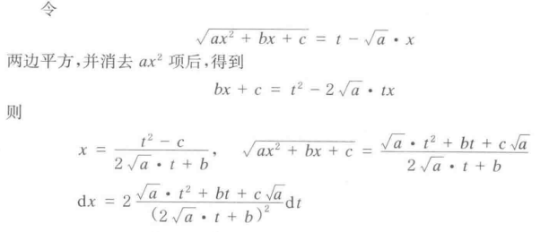
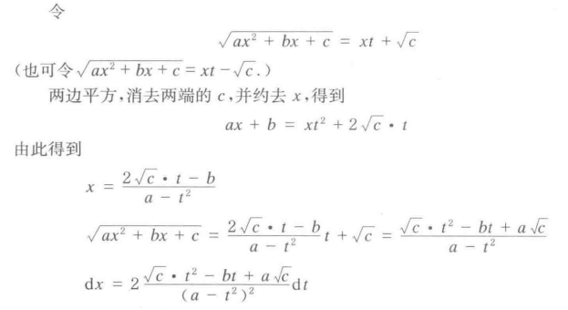
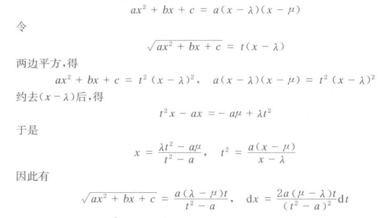
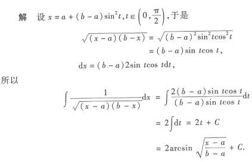
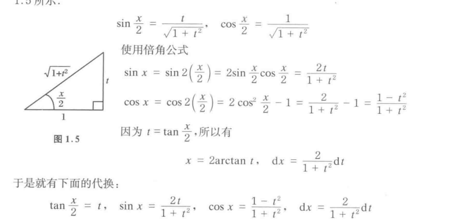
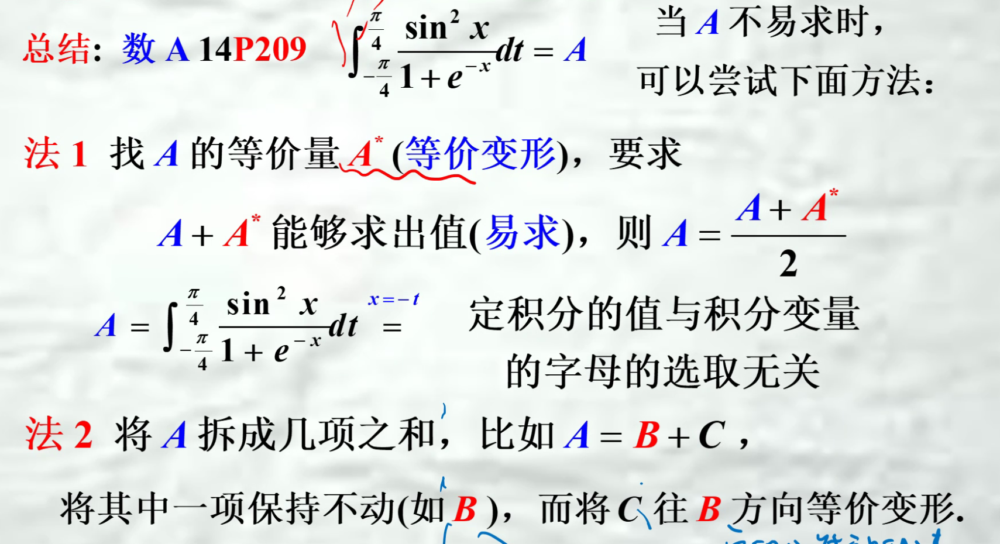

## X的多项式与分式
1. $$
分母次数大于分子\begin{cases}
   换元法一步求解\\ 倒代换 \\  分母因式分解拆开为单独的项，分子化为各项之和（待定系数）
\end{cases}
$$
2. 分母次数小于分子：化为有理项+真分式
3. ==换元时要标注$\theta$的取值范围==
* $(a^{2}-x^{2})^{n} \xrightarrow{} x=a\sin \theta$ ，$\theta \in [\frac{-\pi}{2},\frac{\pi}{2}]$
* $(a^{2}+x^{2})^{n}\xrightarrow{} x=a\tan \theta$，$\theta \in (\frac{-\pi}{2},\frac{\pi}{2})$
* $(x^{2}-a^{2})^{n}\xrightarrow{} x=a\sec \theta$，$\theta \in (0,\frac{\pi}{2})\cup (\frac{\pi}{2},\pi)$
4. 倒代换
5. 欧拉替代（优先度较低）
   对于$\sqrt{ax^{2}+bx+c}$
    1. 多项式没有根：
        1. a>0
        
        2. c>0
        
    2. 多项式有相异实根
        
简便算法：

对于$\sqrt{(x-a)(x-b)}$
$\sqrt{(x-a)(x-b)}=\sqrt{(x-\frac{a+b}{2})^{2}-\frac{(a-b)^{2}}{4}}$
$\int \frac{1}{\sqrt{(x-a)(x-b)}}dx=\int \frac{1}{\sqrt{(x-\frac{a+b}{2})^{2}-\frac{(a-b)^{2}}{4}}}d(x-\frac{a+b}{2}) =\ln \left\vert x-\frac{a+b}{2}+\sqrt{(x-a)(x-b)} \right\vert $

## 三角函数
1. 万能替代法
   
   ==需注意换元后的函数，导数需要在区间内部连续，比如tan$\frac{x}{2}导数在\pi处不连续$==
   对策：1. 换限，将奇点从区间中间转换到区间端点$([0,2\pi]\rightarrow[0,\pi]+[\pi,2\pi])$
   2. 利用周期性换限
   3. 利用不定积分求出原函数
2. 华莱士公式
   $\int_{0}^{\frac{\pi}{2}}\sin ^{n}x\mathrm{d}x=\int_{0}^{\frac{\pi}{2}}\cos ^{n}x\mathrm{d}x=\begin{cases}
    \frac{n}{n-1}\times \frac{(n-2)}{n-3}\times \cdots \times \frac{2}{3}\times 1 ,n是奇数\\ \frac{n}{n-1}\times  \frac{(n-2)}{n-3}\times \cdots \times \frac{3}{4}\times \frac{1}{2}\times \frac{\pi}{2},n是偶数
   \end{cases}$
   若定积分区间是$\frac{\pi}{2}$的倍数，可通过换元来符合使用条件
3. $\sin y=f(x)不要轻易代y=\arcsin f(x) $**定义域问题**
4. 定积分问题
## 指数对数

1. $\int_{0}^{1}  \mathrm{d}x\frac{\ln (1+x)}{1+x^{2}}dx\xrightarrow{x=\frac{1-t}{1+t}}\int_{1}^{0}t \frac{\ln (\frac{2}{1+t})}{\frac{2t^{2}+2}{(1+t)^{2}}}\times \frac{-2}{(1+t)^{2}}dt=\int_{0}^{1} \frac{\ln 2-\ln (1+t)}{1+t^{2}}dt$
   $\therefore \int_{0}^{1} \frac{\ln (1+x)}{1+x^{2}}dx=\frac{1}{2}\int_{0}^{1}\frac{\ln 2}{1+t^{2}}$
  **遇到$\int_{0}^{1}可以试试$**

  ## 定积分换元技巧（穷途末路试试看）
  1. $\int_{0}^{1}  \mathrm{d}x $ , $x=\frac{1-t}{1+t}$
  2. $\int_{0}^{\pi}  \mathrm{d}x$ , $x=\pi -t$