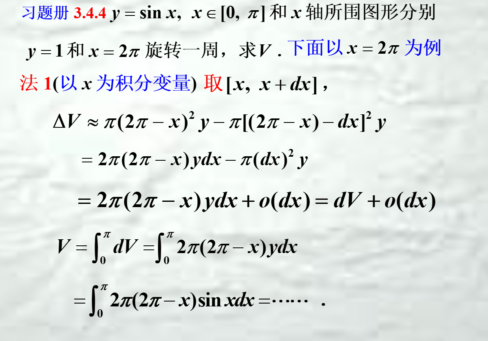

 ## 直角坐标系面积
 $\int_{a}^{b} \left\vert y \right\vert  \mathrm{d}x$
  $\int_{a}^{b} \left\vert x \right\vert  \mathrm{d}y$
 其中b>a
 适用于参数方程

## 极坐标系面积
$\int_{a}^{b}\frac{1}{2}(\phi(x_1)^{2}-\phi(x_2)^{2})  \mathrm{d}x$

## 旋转体体积
dx:竖着切长方形微元

dy：横着切长方形微元

绕x轴旋转：常选dx
v=$\int_{a}^{b}(y_2^{2}(x)-y_1^{2}(x))  \mathrm{d}x$
绕y轴旋转：常选dy
v=$\int_{a}^{b}(x_2^{2}(y)-x_1^{2}(y))  \mathrm{d}y$