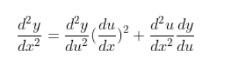

# 导数
## 定义

==某点可导$\to$某点连续==
两个函数相等$\leftrightarrow$导数相同且经过同一点

## 基本初等函数的导数

## 求导
1. 四则运算
2. 反函数求导
3. 复合函数的链式法则
4. 对数求导
5. 参数方程求导
6. 隐函数求导

## 高阶导数求导
1. 
   ==很重要！！！==
   尤其适用于其中一项为x的多项式
2. 定义求解，综合求极限的各种方法
3. **复合导数不满足链式法则**
   
4. 使用泰勒展开Peano余项（常用于复合函数，其中一项可以展开）$F^{(n)}(x)=n!\cdot a_n$
   $先用间接法求泰勒多项式，再得到$a_n
   常见于求$f^{(n)}(0)$
   

## 常见高阶导数

