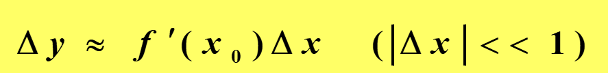

## 定义
微分：$指A\Delta x$

可微必可导（必连续）

## 求微分
1. 四则运算
2. 
3. 求f '(x)
4. 

## 应用
1. 近似证明不等式
2. 近似解决实际问题

## 基本定理
1. 
**2.** 
3. 
4. 
5. 
**6.** 

## 泰勒展开
 f(x)在 $x_{0}$处带Peano余项的n 阶Taylor公式
 
 f(x)在 $x_{0}$处带Peano余项的n 阶Maclaurin公式
 
 f(x)在 $x_{0}$处带Lagrange余项的n 阶Taylor公式
 
 f(x)在 $x_{0}$处带Lagrange余项的n 阶Maclaurin公式
 

-----
 

 ## 部分初等函数的泰勒展开
 
 
 
 wip...