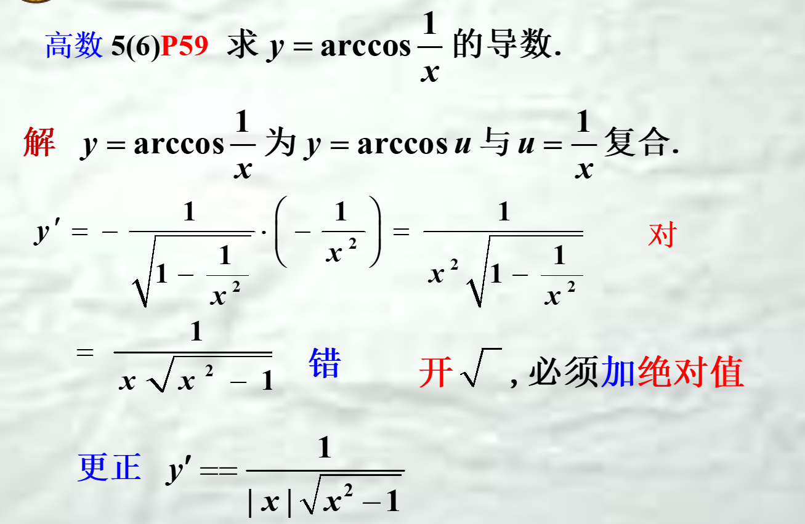

1. **求导前一定要看函数可不可导**，不可导的点用定义lim
2. **微分一定要加上dx**
3. 牢记拉格朗日中值定理（柯西中值定理）：连接原函数与导数的桥梁
    以及导数定义
    达布中值定理(Darboux)：若函数f(x)在[a,b]上处处可导，则f′(x)在[a,b]上可取f′(a)和f′(b)之间的任何值.
4. 
   这种情况应用$\lim_{x \to 0}\cos x +a=\lim_{x \to 0}\frac{\cos x +a}{x^{2}}\times x^{2}=\lim_{x \to 0}\frac{\cos x +a}{x^{2}}\times \lim_{x \to 0}x^{2}=0$ 求解
5. Talyor的拉格朗日余项要写出$\xi$所属区间
   > 其中$\xi$间于0，x之间
6. Talyor的Peano余项里的值应是最大次幂，如$o((x-1)^{n})$
7. 善结合使用无穷小代换、洛必达，行不通便用泰勒展开Peano余项
8. 求极值若只有极大值，需要说极小值不存在
9.  求数列极限不能用洛必达，可以用Stolz公式
10. 
11. $x \to \infty的极限不好求，可以取t=\frac{1}{x}而求t \to 0的极限$、
12. $f(x)在x=x_o连续且f(x_o)>0可推出存在x_o的邻域使f(x)>0$
13. 求证f(x)在[a,b]上关于f(a),f(b),f'(a)的不等式，可用Talyor带拉格朗日余项，取$\xi =\frac{a+b}{2}$
14. 