## 一阶线性微分方程
$y^{'}+P(x)y=Q(x)$
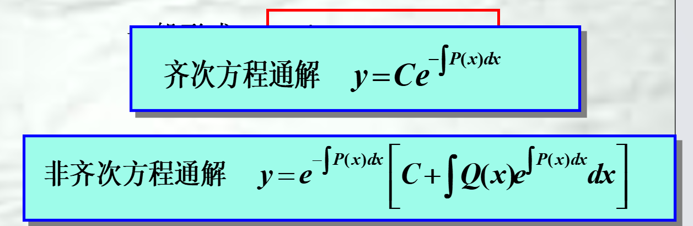
由常数变易法推出
=
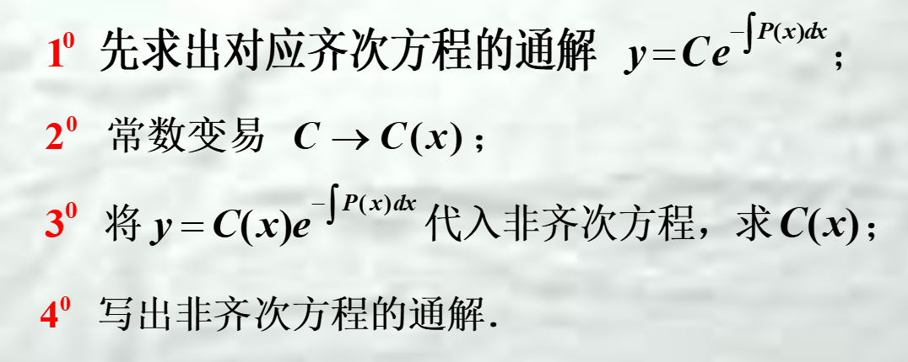

## 一阶微分方程常见模型
1. 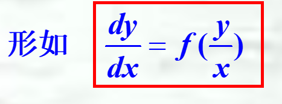
2. 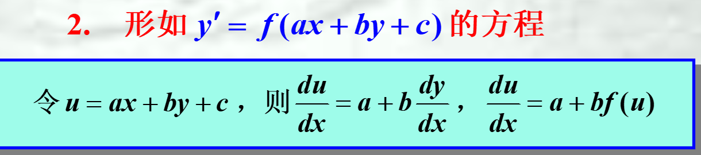
3. 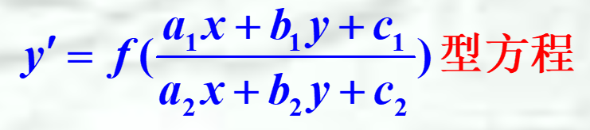
   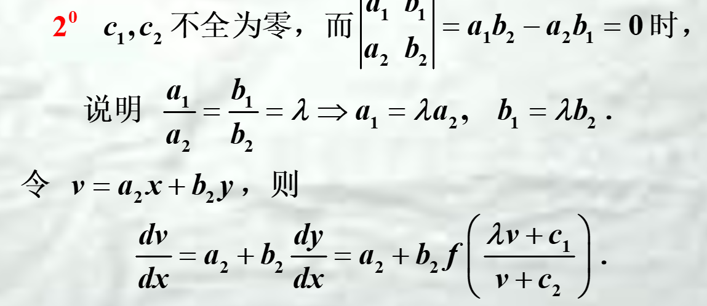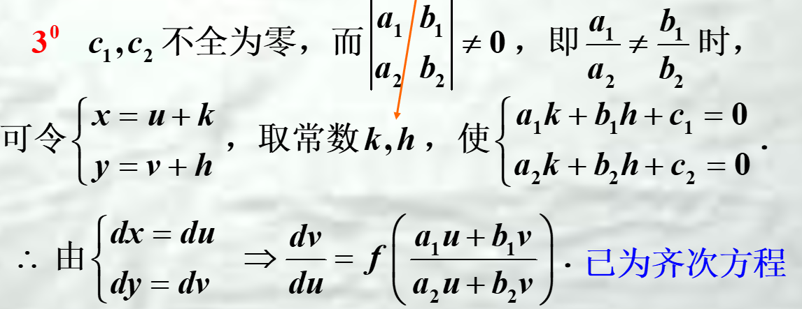
4. 以y作为自变量
5. 伯努利方程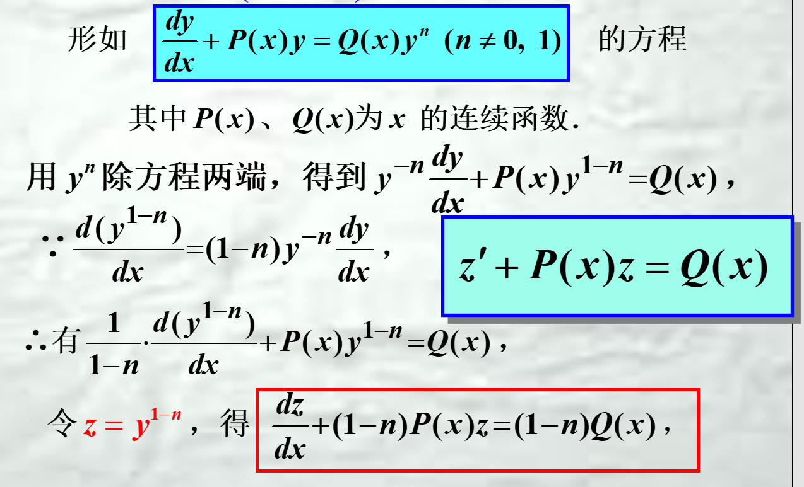
   
## 可降阶高阶微分方程
1. 多次积分
2. 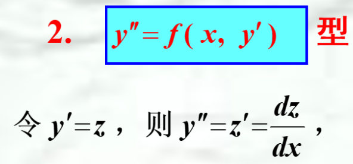
3. $y^{''}=f(y,y^{'})型$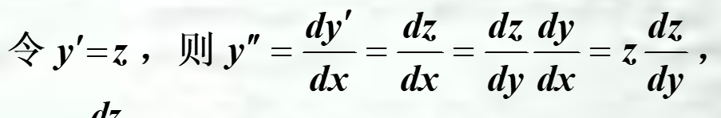

## 二阶线性微分方程解法（仅含$y^{''},y^{'},y$）
### 线性相关与线性无关
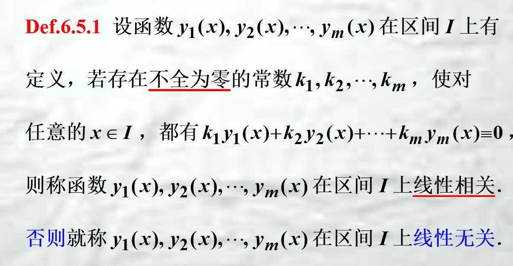
由于是存在，故0与任何函数线性相关

判断是否线性无关
=
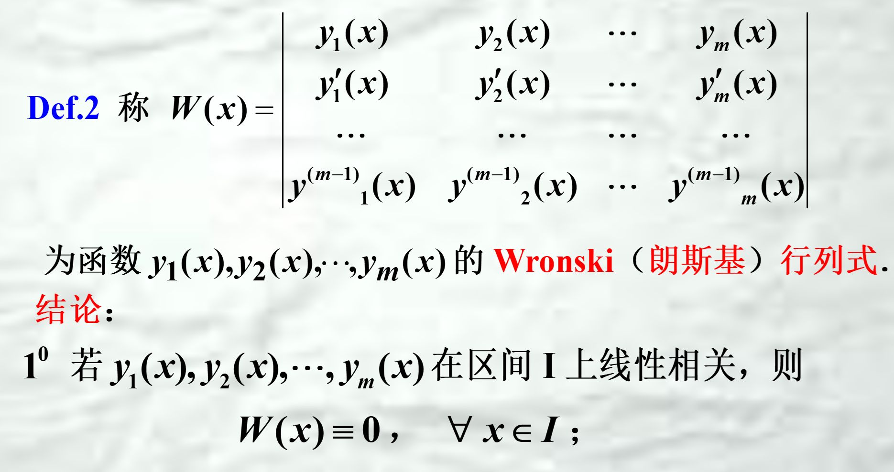
==充分不必要条件==
1. 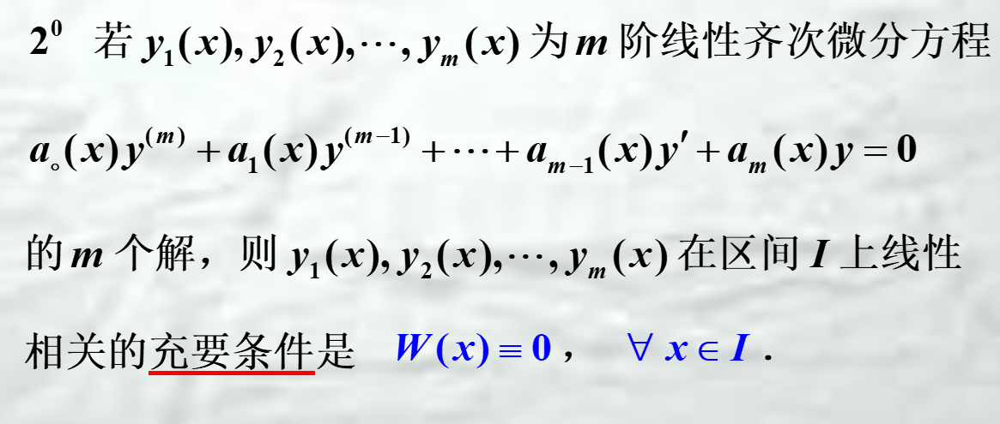
2. 两个函数的线性关系可由除数是否为常数判断
### 特征方程求解齐次通解
   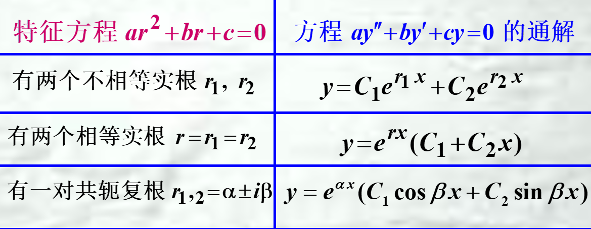
高阶特征方程：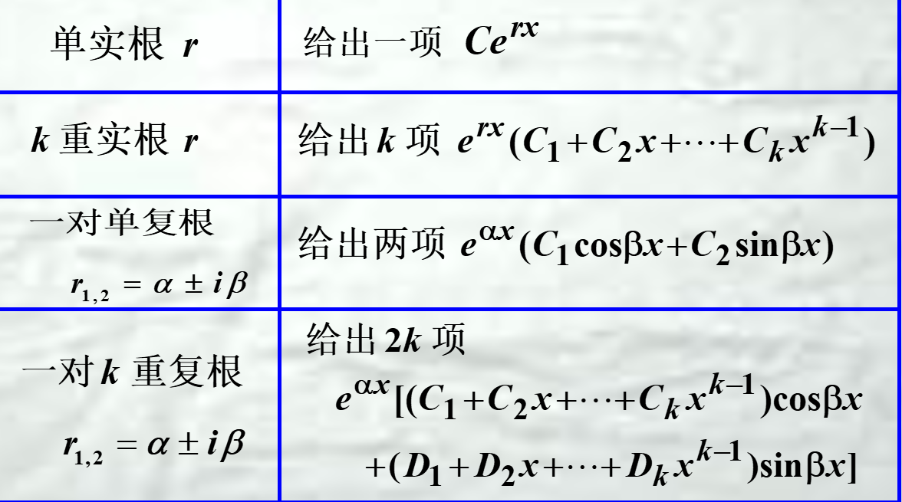
### 非齐次特解求法
#### $ay^{''}+by^{'}+cy=P_{m}(x)e^{ax}$
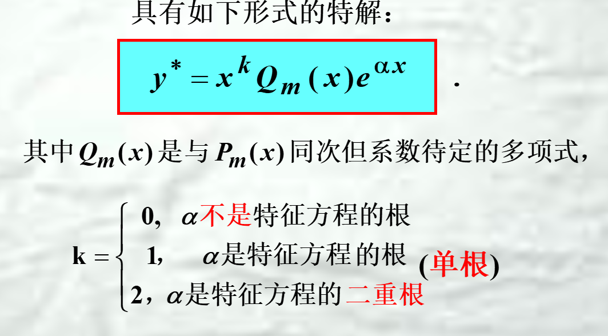
#### $ay^{''}+by^{'}+cy=P_{m}(x)e^{ax}\cos \beta x或P_{m}(x)e^{ax}\sin \beta x$
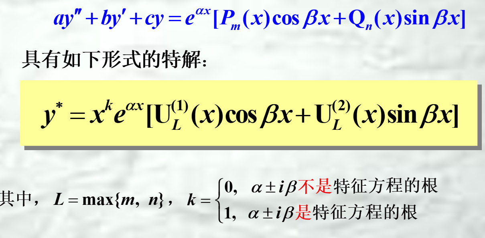