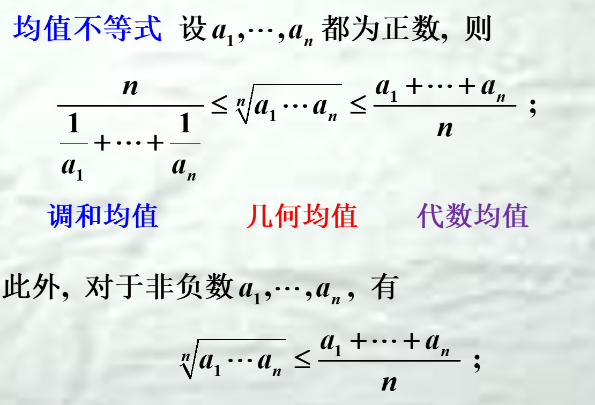
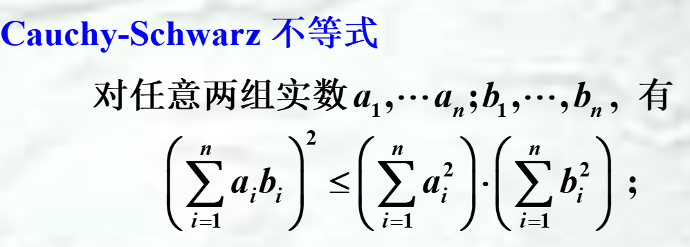
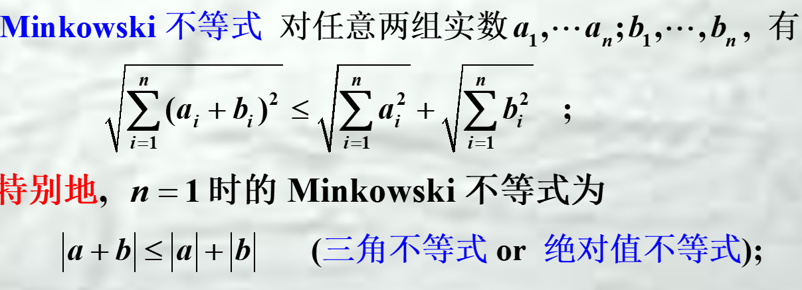
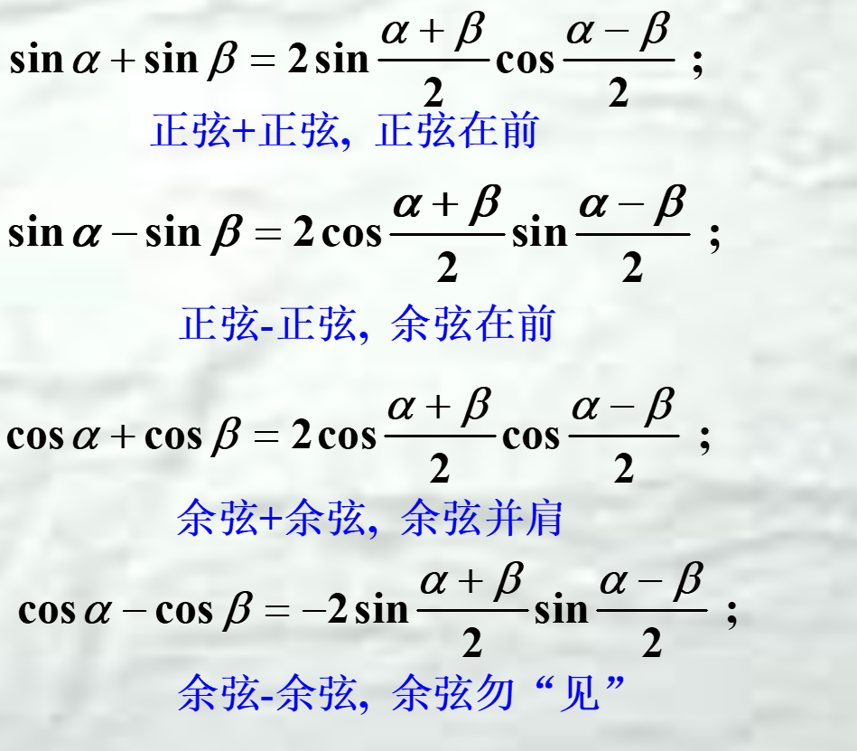
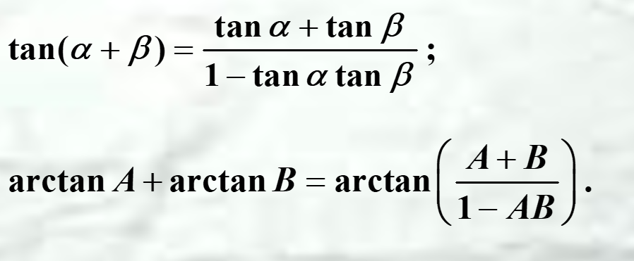

1. n次方差公式 $a^{n}-b^{n}=(a-b)(a^{n-1}+a^{n-2}b+ \cdots +b^{n-1})$
   扩展：可用于开根号，关键项x-1
2. Bernoulli不等式  设 n为非负整数, 则$(1+x)^{n}\ge nx+1,\forall x\ge  -1$
3. 
4. 
5. 
   ==绝对值的三角不等式==
6. Young不等式 设 a和 b为非负实数, p 和 q为正实数, 且$\frac{1}{p}+\frac{1}{q}=1,则ab\le \frac{a^{p}}{p}+\frac{b^{q}}{q}$
7. 和差化积
8. 