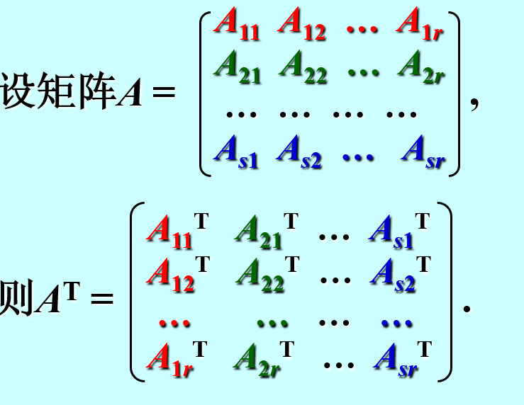
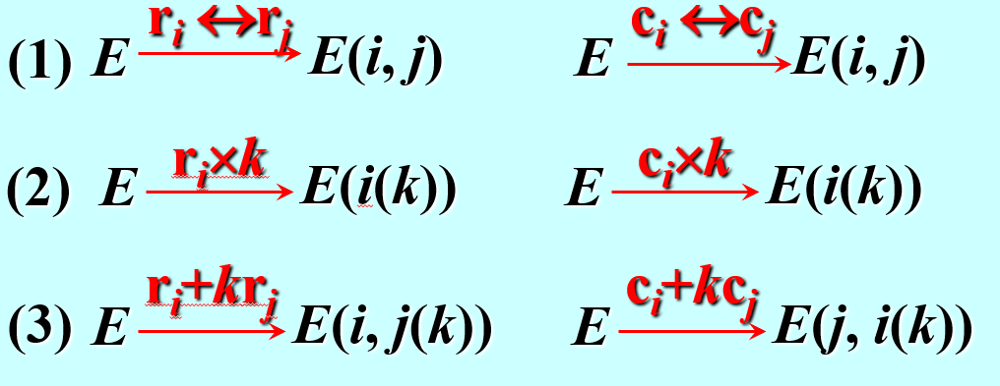

# 特殊矩阵

#### 零矩阵
==不止为方阵==
#### 对角矩阵
通常用 $\land $表示，可记为$\land $=diag($a_{11},a_{12},\dots$)
#### 数量矩阵
对角矩阵主对角线上元素相等
#### 单位矩阵
==只能方阵==
#### 三角矩阵
上三角下三角，主要应用于求分列式及方阵的LU分解
#### 行阶梯型矩阵
主要用于求秩
#### 行最简型矩阵
暂时未知
#### 对称矩阵
$A^{T}$=A或$A_{ij}=A_{ji}$
#### 反对称矩阵
$A_{ij}=-A_{ji}$
*故主对角线元素都为0*

# 线性运算
$\begin{cases}
    加法 \\ 数乘：kA=O \xrightarrow{} k=0或A=O
\end{cases}$

# 矩阵的乘法
==结合律==：(AB)C=A(BC)
==分配律==:A(B+C)=AB+AC *注意左乘右乘*
~~交换律~~：AB$\neq $BA  *同阶对角矩阵及逆矩阵满足交换律*
~~消去律~~：A=O,AB=AC$\Rightarrow$B=C 未必成立

$(A+B)^n=\sum_{i=0}^nC_n^iA^{i}B^{n-1}$ 当A=B时成立**

**特殊矩阵的幂**
$$A=
\begin{bmatrix} 
    1 & 1\\0 & 0 
\end{bmatrix}  ，A^{k}=A
$$$$
B=\begin{bmatrix} 
    1 & 0\\ 1 & 0 
\end{bmatrix} , B^{k}=B
$$

# 矩阵的转置

# 分块矩阵
**$按列分块\rightarrow行向量$
$按行分块\rightarrow列向量$
分块对角矩阵**

# 初等变换
1. 对换变换
2. 倍乘变换
3. 倍加变换
**若矩阵A经过有限次初等变换化为B, 则称A与B等价(equivalent). 记作$A\cong B$**

$E^{(r)}_{m \times n}为A_{m\times n}$的等价标准形
任何一个矩阵都可以经过有限次初等变换化为标准形.
*变换技巧：按从第一列到最后一列的顺序，先将A变换为行最简形再变为等价标准形*

# 初等矩阵

初等矩阵左乘：行变换
初等矩阵右乘：列变换

# 逆矩阵

