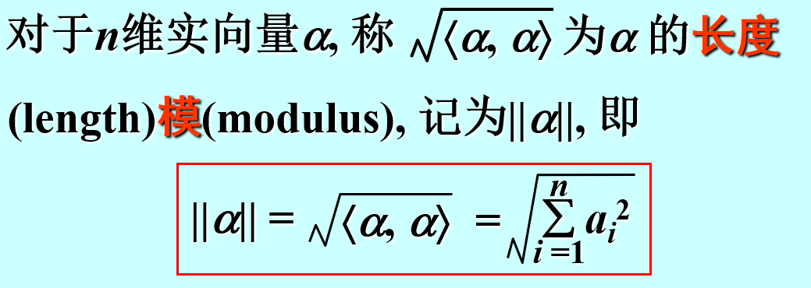
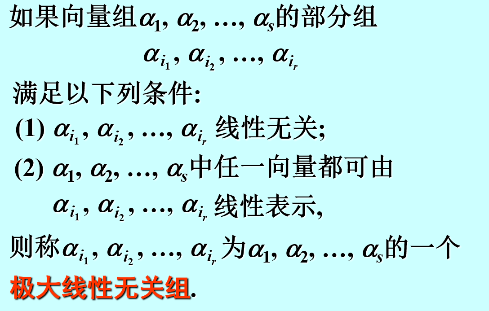

 # 向量
 ## 概念
 本质：n个数构成的有序数组
 表现形式：行向量/列向量

 ## 向量的长度
 

 ## 线性组合和线性表示
 $a_1,a_2,a_3, \ldots ,a_n是n维向量，k_1,k_2,k_3, \ldots ,k_n是数$
 则称向量$\eta =k_1a_1+k_2a_2+ \cdots +k_n a_n 可以由a_1,a_2, \ldots ,a_n线性表示$
**若两个向量组能互相线性表示，则称它们等价**

 ## 向量组的秩
 $r(a_1,a_2, \ldots ,a_s)\le s$
 $r(a_1,a_2, \ldots ,a_s)< s$:线性相关
 $r(a_1,a_2, \ldots ,a_s)= s$:线性无关

## 线性相关的性质
1. 等价刻画
2. 

## 线性无关的性质
1. 

## 极大线性无关组

极大线性无关组向量个数=向量组的秩

 